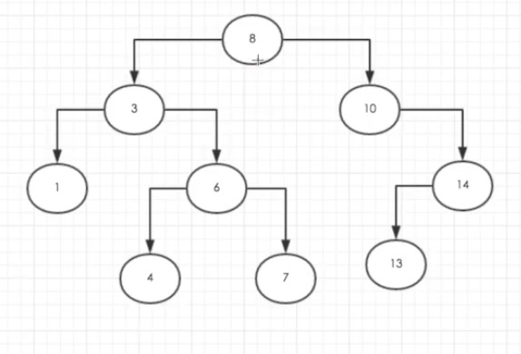

# BinarySearchTree(二叉搜索树)

> 二叉搜索树（BST）是二叉树的一种，但是它只允许你在左侧节点存储（比父节点）小的值，
在右侧节点存储（比父节点）大（或者等于）的值

二叉搜索树（BST）的具体实现， 封装在 ./binarySearchTree.js中的 BinarySearchTree类, 里面封装了关于下列功能的实现

## 树的数据结构
[8, 3, 10, 1, 6, 14, 4, 7, 13];

## 树的遍历

- 中序 (inOrderTraverse)
- 先序 (preOrderTraverse)
- 后序 (postOrderTraverse)

## 树的搜索
- 搜索树中最小值 (min)
- 搜索树中最大值 (max)

## 树中值的移除
- 移除指定值 （remove）
